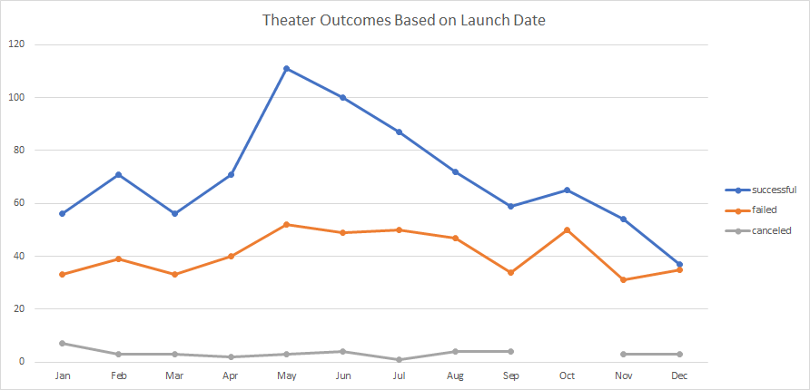
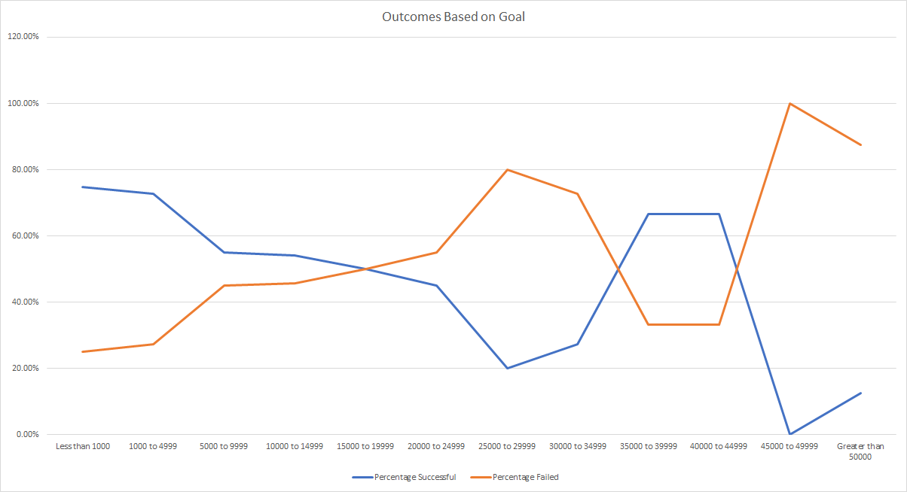

# Kickstarting with Excel
## Overview of Project
### Purpose
The playwright Louise has estimated that it will cost her around $10,000 to put on her first play, "Fever." She would like to crowdfund the startu-up capital needed for the play using the web platform Kickstarter. Louise has asked our consulting firm to review Kickstarter data to identify whether there are significant factors that might influence the outcome of her Kickstarter campaign. Specifically, Louise wants to know when to launch her campaign, and what her target funding goal should be.
## Analysis and Challenges
### Analysis of Outcomes Based on Launch Date
The project team reviewed Kickstarter data from 2009-2017, analyzing season trends regarding Kickstarer project success. By filtering out all Kickstarter projects except for Plays, the project team was able to identify that there is a significantly greater chance for plays to be kickstarted successfully if the campaign is launched during the Summer months.

### Analysis of Outcomes Based on Goals
The project team reviewed over 1000 play-specific projects, analyzing trends regarding Kickstarer project success. While this data shows some significant fluctuations, there are clear trendlines which indicate that the larger the goal price, the more likely the project is to fail.

### Challenges and Difficulties Encountered
#### What are some limitations of this dataset?
The provided dataset does not extend beyond 2017, so the project team was unable to identify whether any significant trends have occured during recent years. Additionally, these trends may have been negatively impacted by the pandemic as many people are unable to attend plays in the theatre. Additionally, there may be other datapoints which would significant inform the success rate of projects. For example, the city of the creator may be a significant indicator of success - plays may be more likely to receive funding in cities like Chicago or New York that have well-established art scenes. Additionaly, the genre and subject-matter of the plays may have an impact on the success rate. For example, modern renditions of Shakespearean plays may be more likely to receive support than experimental improv theatre. 
#### What are some other possible tables and/or graphs that we could create?
For some creators, Kickstarters serve as a form of advertisement. These creator may be interested in increasing the total number of backers for the sake of exposure, even if the average pledge is at a lower amount. If Louise is interested in maximizing her backer count, it could be worth exploring backer count as a function of other factors like goal and date with a graph. Additionally, the Kickstarter "Staff Pick" indicator may have a significant impact on the likelihood of the project to receive a successful outcome. It may be worth identifying the statistical relationship between "staff pick" and "outcome" fields. If there is a statistical relationship, it would be worth exploring how Loise could maximize her chances of receiving the "staff pick" status.
## Results
#### What are two conclusions you can draw about the Outcomes based on Launch Date?
The months of May, June, and July are the months with the most successful project launches. As a result of this analysis, the team recommends the following: 
1. For the greatest chance of success, Louise should launch her Kickstarter campaign during the month of May. 
2. Theatre projects have the lowest chance of success if they are lauched in December, Louise should avoid launching her campaign then.
#### What can you conclude about the Outcomes based on Goals?
Since Kickstarter has a policy where the creator gets nothing when a project fails, it may be advisable to set the initial goal below $5000. However, if the projected $10,000 budget is a minimal viable project threshold then Louise should be aware that there is a greater risk of the project not meeting the goal threshold. Specifically: 
1. Projects with goals between $1000 and $4999 have a 73% success rate.
2. Projects with goals set between $5000 and $9999 only have a 55% success rate. 
